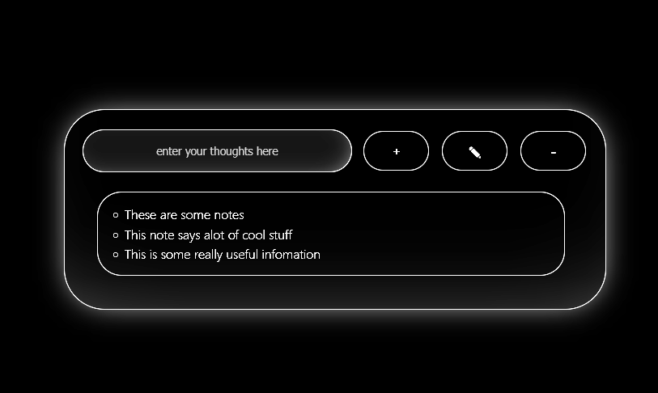
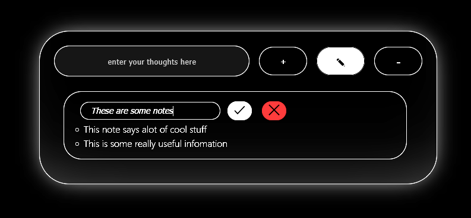
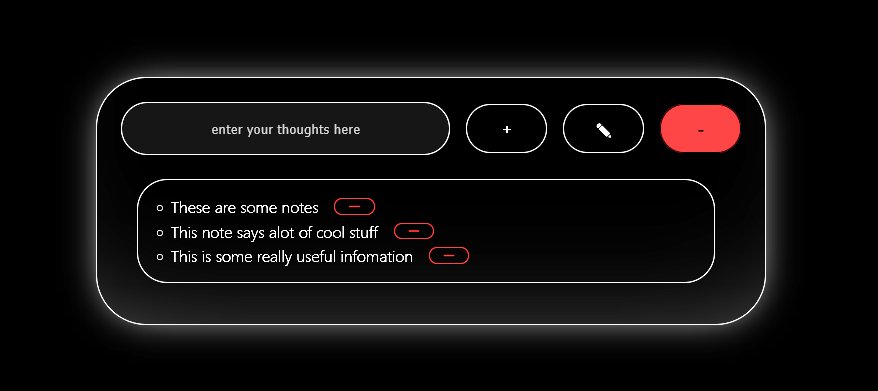
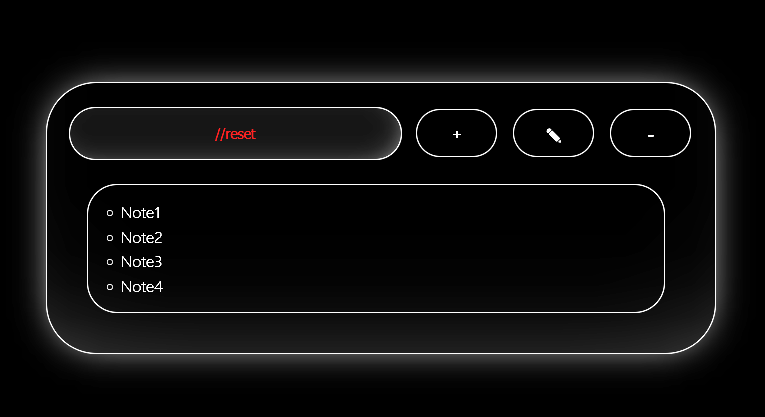
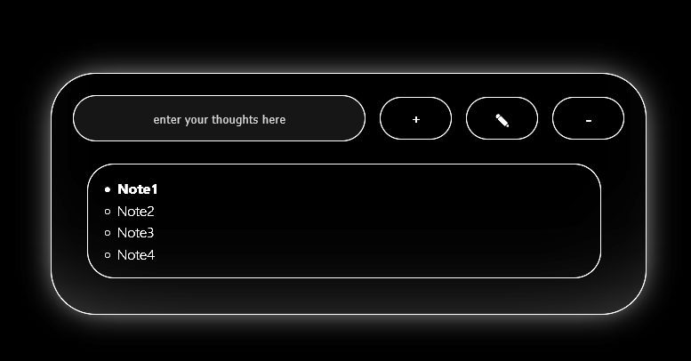

# INFO

- I made this website to practice typescript so pls don't expect to much from this

# FEATURES

- Press ENTER while being focused on the inputfield to add a Note (_*or press the add note button*_)
  

- While being in edit mode double click a note to edit it
  

- While being in remove mode press the remove button next to the note you want to delete
  

- If you want to reset the entire website just type **"//reset"** into the inputField
  

- If you do not have any toggle on you can double click a note to highlight it
  

## HOTKEYS

- ALT + E to toggle edit mode
- ALT + R to toggle remove mode

# IMAGES

_*I hope you like this small project c:*_ _***-Dash***_
